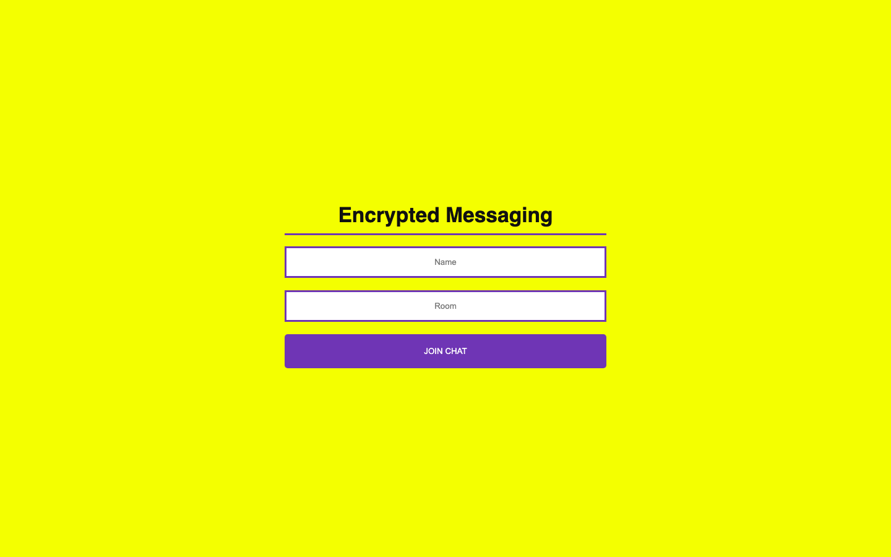
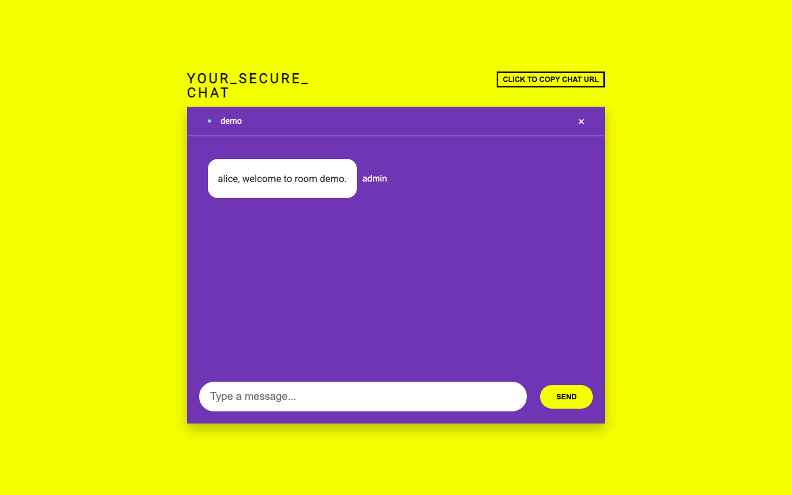
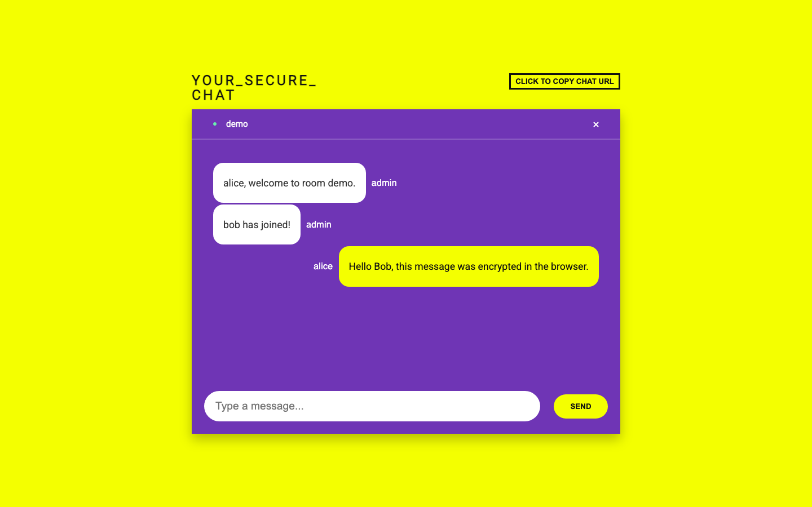

# E2EE Web Application

A real-time encrypted messaging demo exploring browser-side encryption, shared room secrets, and Socket.IO chat rooms.

This is a portfolio/academic demo, not a production-ready E2EE messenger. It is useful for showing the shape of browser-side encryption and real-time room messaging, but it does not implement production key exchange, identity verification, account security, persistence, abuse controls, or a complete threat model.

## Academic Background

This project began as a university group project for exploring encrypted messaging on the web. The original paper, [Messaging Encryption With Ephemeral Limits](docs/e2ee-paper.pdf), researched end-to-end encrypted messaging systems, the Signal Protocol, public-key cryptography, Web Crypto, AES-GCM, real-time chat UX, and the challenge of explaining security concepts clearly to non-expert users.

The original project goal was to make a browser-based chat application that could:

- Encrypt and decrypt chat messages in the browser.
- Use familiar real-time chat rooms for private or group conversations.
- Reduce user burden by handling cryptographic operations behind the UI.
- Experiment with ephemeral limits so sensitive messages would not accumulate indefinitely.
- Teach users that encrypted messaging has both benefits and tradeoffs.

This repository is a revived and polished version intended for a software engineering portfolio. The revival keeps the core learning project intact while making it easier to run, inspect, and deploy.

Modernization work includes:

- Vercel configuration for deploying the React frontend.
- Clear separation between the static frontend and long-running Socket.IO backend.
- Environment variable documentation for local, Vercel, and backend-hosted deployments.
- README updates that position the project accurately as an educational demo.
- Dependency lockfile cleanup and removal of generated artifacts from git tracking.
- Portfolio screenshots and clearer project storytelling.

## Screenshots

### Join Room



### Chat Room



### Message Flow



## Architecture

The application is split into a React frontend and an Express/Socket.IO backend.

- `client/`: Create React App frontend for joining rooms, sending messages, and rendering chat history.
- `server/`: Express server with Socket.IO events for joining rooms, relaying messages, broadcasting room data, and tracking connected users in memory.
- Browser Web Crypto: messages are encrypted in the browser with AES-GCM before being emitted through Socket.IO.
- Room-based communication: users join a named Socket.IO room, and the server broadcasts messages only to sockets in that room.
- Message flow: a user enters a name and room, the client connects to the Socket.IO server, the sender encrypts a message locally, the backend relays the encrypted payload, and each browser attempts to decrypt the payload for display.

The backend acts as a real-time relay. It does not need to decrypt messages to broadcast them, but the current demo derives the key from the room name, and the room name is sent to the server as part of joining. That makes this an educational encryption flow, not a server-blind production E2EE protocol.

## Project Structure

```text
.
├── client/             # Create React App frontend
├── server/             # Express + Socket.IO server
├── docs/
│   ├── e2ee-paper.pdf  # Original academic paper
│   └── screenshots/    # Portfolio screenshots
├── scripts/            # Screenshot capture helper
├── .env.example        # Combined environment variable reference
└── vercel.json         # Vercel config for deploying the frontend
```

The frontend and backend are separate apps. The frontend builds to static files and is a good fit for Vercel. The backend is a long-running Socket.IO server and should be deployed separately on a host that supports persistent WebSocket connections.

## Security Discussion

This demo provides:

- Browser-side encryption before messages are sent through the Socket.IO relay.
- AES-GCM authenticated encryption for message payloads.
- Random initialization vectors for each encrypted message.
- A simple way to show that the backend can relay ciphertext without rendering plaintext message bodies.
- Room-scoped real-time messaging so participants in the same room see the same encrypted payloads.

This demo intentionally does not provide:

- Production-grade end-to-end encryption.
- A real key exchange protocol such as X3DH.
- Double Ratchet message keys, forward secrecy, post-compromise security, or deniable authentication.
- User identity verification, account authentication, or device trust.
- Secure secret sharing. The room name is used to derive the demo key, and the server receives the room name.
- Protection for metadata such as room names, usernames, connection timing, message sizes, or participant lists.
- Durable persistence, secure deletion, or multi-instance Socket.IO coordination.
- Ephemeral session timeout behavior from the original paper.

The original academic paper discussed stronger secure messaging protocols and acknowledged that the student implementation did not reach full E2EE. The current repository keeps that honesty: it demonstrates the mechanics of encrypting in the browser and relaying ciphertext in real time, but it should not be used as a secure messaging product.

## Lessons Learned

Revisiting this project after more engineering experience highlights a few lessons.

Browser cryptography is powerful but easy to overstate. The Web Crypto API provides real primitives like AES-GCM, but secure messaging depends on the entire protocol around those primitives: key exchange, identity, verification, rotation, storage, and recovery.

Real-time systems add product and infrastructure constraints. Socket.IO made rooms, joins, broadcasts, and disconnects approachable, but deploying a persistent WebSocket server is different from deploying a static frontend or a serverless function.

Client/server architecture shapes the security model. Encrypting in the browser is useful, but if the server receives the value used to derive the key, the system should be documented as an educational demo rather than true server-blind E2EE.

Deployment polish matters for portfolio work. The revival focused on making the project reproducible: documented environment variables, separate deployment targets, clean build scripts, and removal of generated files from version control.

Security tradeoffs need plain language. A user or recruiter should be able to understand what is protected, what is visible to the server, and what a production system would require.

What I would build differently today:

- Use a real authenticated key agreement protocol instead of deriving a shared key from the room name.
- Keep room identifiers and encryption secrets separate.
- Add identity verification and device-level trust.
- Add tests around encryption/decryption and Socket.IO event behavior.
- Use a maintained frontend stack and typed interfaces.
- Add persistence only after designing encryption, retention, and deletion semantics.
- Treat the security model as a first-class product surface, not a footnote.

## Requirements

- Node.js 18 or newer
- npm 10 or newer

## Environment Variables

Client, in `client/.env` or Vercel project settings:

```bash
REACT_APP_SERVER_URL=http://localhost:3001
```

Server, in `server/.env` or the server host settings:

```bash
PORT=3001
CLIENT_ORIGIN=http://localhost:3000
```

For production, set:

- `REACT_APP_SERVER_URL` to the public HTTPS URL of the Socket.IO server, such as `https://your-chat-server.onrender.com`.
- `CLIENT_ORIGIN` to the public Vercel frontend URL, such as `https://your-project.vercel.app`.

`CLIENT_ORIGIN` also accepts comma-separated origins for local plus deployed testing:

```bash
CLIENT_ORIGIN=http://localhost:3000,https://your-project.vercel.app
```

## Run Locally

Install and start the server:

```bash
cd server
npm install
cp .env.example .env
npm start
```

The server runs at `http://localhost:3001` by default.

In a second terminal, install and start the client:

```bash
cd client
npm install
cp .env.example .env
npm start
```

The client runs at `http://localhost:3000` by default.

## Build Locally

Build the React frontend:

```bash
cd client
npm run build
```

The compiled frontend is written to `client/build/`.

The Socket.IO server does not have a compile step. It runs with:

```bash
cd server
npm start
```

## Deploying

### Frontend on Vercel

This repository includes `vercel.json` for deploying the Create React App frontend from the repo root.

In Vercel:

- Import the repository.
- Keep the project root as the repository root.
- Add `REACT_APP_SERVER_URL` with the public URL of the deployed Socket.IO server.
- Deploy.

The Vercel config runs:

```bash
cd client && npm ci
cd client && npm run build
```

and serves `client/build`. The SPA rewrite in `vercel.json` keeps direct links like `/chat?name=...&room=...` working.

### Backend on Render, Railway, Fly.io, or Similar

Do not rely on Vercel serverless functions for this Socket.IO backend. Socket.IO needs a long-running process and reliable WebSocket support, while Vercel serverless functions are request/response oriented and not designed for persistent socket servers.

Deploy `server/` to a platform such as Render, Railway, Fly.io, or another Node host that supports WebSockets. Configure:

Render settings:

- Root Directory: `server`
- Build Command: `npm install`
- Start Command: `npm start`
- Environment Variable: `CLIENT_ORIGIN=https://your-project.vercel.app`

Server environment:

```bash
PORT=<provided by host>
CLIENT_ORIGIN=https://your-project.vercel.app
```

Then update the Vercel frontend environment variable:

```bash
REACT_APP_SERVER_URL=https://your-chat-server.example.com
```

## Available Scripts

Client:

- `npm start`: run the React development server.
- `npm run build`: build the production React bundle.
- `npm test`: run the Create React App test runner.

Server:

- `npm start`: run the Express + Socket.IO server.
- `npm run dev`: run the server with Nodemon.

## Accuracy Check

| Feature from paper | Present in current implementation? | Notes |
| --- | --- | --- |
| React frontend | Yes | The client remains a Create React App interface. |
| Express backend | Yes | The server uses Express for a small HTTP endpoint and Socket.IO host. |
| Socket.IO real-time rooms | Yes | Users join room names and messages are broadcast to that room. |
| Browser-side Web Crypto | Yes | Current code uses `window.crypto.subtle`. |
| AES-GCM encryption | Yes | Messages are encrypted with AES-GCM and a per-message random IV. |
| Background encryption/decryption | Yes | Sending encrypts before emit; receiving decrypts before display. |
| Shared room secret | Partially | The current key is derived from the room name using PBKDF2. This is demo-only. |
| Private/public key exchange | No | The paper researched public-key systems, X3DH, and Signal concepts, but this repo does not implement them. |
| Double Ratchet or forward secrecy | No | No message key ratcheting or post-compromise security is implemented. |
| Ephemeral 10-minute session timeout | No | The paper described a timeout experiment, but the current revived app does not include it. |
| Hover-to-decrypt educational UI | No | The current UI displays decrypted messages directly or an error if decrypting fails. |
| Copy chat URL | Yes | The chat screen includes a button to copy the current room URL. |
| In-memory user and room state | Yes | Connected users are stored in a process-local array and disappear on restart. |
| Heroku deployment | No | The revived deployment path documents Vercel for frontend and Render/Railway/Fly.io-style hosts for backend. |
| Production-ready E2EE | No | The project is explicitly documented as an educational portfolio demo. |

## Updating Screenshots

The README screenshots live in `docs/screenshots/`.

To manually refresh them, open the app in two browser tabs or windows, join the same room with two different names, and send a message.

There is also a small Chrome DevTools capture script:

```bash
cd server
CLIENT_ORIGIN=http://localhost:3002 npm start
```

```bash
cd client
PORT=3002 BROWSER=none npm start
```

```bash
"/Applications/Google Chrome.app/Contents/MacOS/Google Chrome" \
  --headless=new \
  --remote-debugging-port=9223 \
  --user-data-dir=/private/tmp/e2ee-chrome-profile \
  --disable-gpu \
  --no-first-run \
  --no-default-browser-check \
  about:blank
```

```bash
node scripts/capture-screenshots.mjs
```
